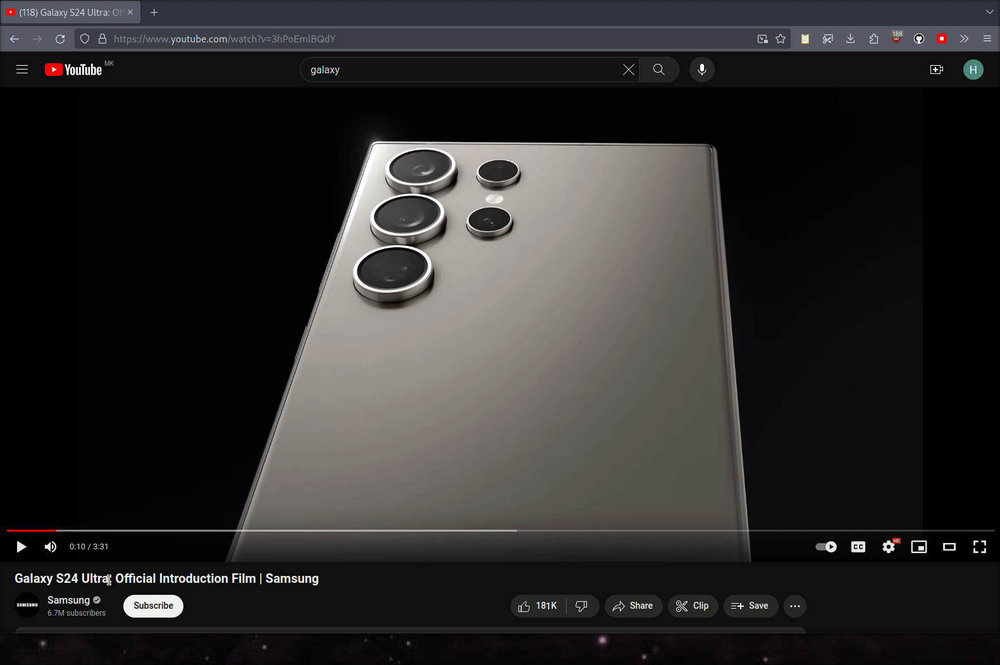

# Keyboardify

| name  | Surname | index  |
|-------|---------|--------|
| Haled | Odat    | 201516 |

An browser extension that works with both firefox and google chrome browsers, for eliminating the need for the mouse while browsing.

This is a browser extension for Firefox and Google Chrome that eliminates the need for a mouse while browsing.
This extension offers two modes: "normal" mode for intuitive keyboard shortcuts and "link" mode activated by pressing 'a'.
In "normal" mode, easily navigate through pages, scroll smoothly, and access browsing history with simple keybindings (see <a href="#keybindings">keybindings</a> section).
In "link" mode, all links on the screen are marked, allowing quick access through letter combinations (taken from the home-row of a QWERTY keyboard).

## Demo

## Keybindings

| Key   | Action                                                |
|-------|-------------------------------------------------------|
| `A`   | Mark all links on the screen, and enters `link` mode. |
| `ESC` | Escape `link` mode (clears all links).                |
| `H`   | Move backwards in the browser history.                |
| `;`   | Move formards in the browser history.                 |
| `K`   | Smooth scroll up.                                     |
| `L`   | Smooth scroll down.                                   |
